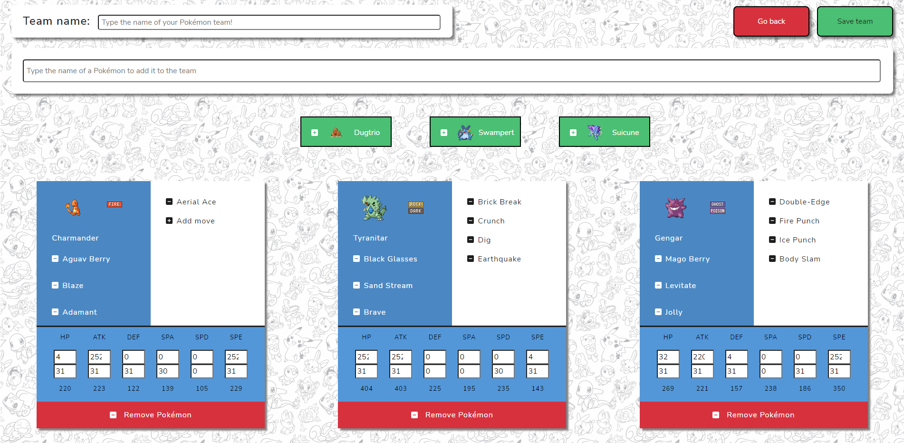

<div align="center">
    <h1>Pokebuilder</h1>
    
</div>


## Acerca de Pokebuilder


La aplicación web Pokebuilder es una aplicación cuyo objetivo es facilitar la creación de equipos tanto para los jugadores
más novatos en el competitivo de la saga como para los más veteranos, aportando sugerencias basadas en datos de uso 
durante la construcción de un equipo Pokémon.


Además, desde la propia aplicación se pueden jugar batallas en la ladder de Pokémon Showdown.

## Cómo usarla

La aplicación corre en la siguiente URL:
```
http://144.24.193.216/
```

Antes de empezar a usarla es necesario tener una cuenta en Pokémon Showdown:
```
https://play.pokemonshowdown.com/
```
Con la cuenta creada, se pueden utilizar las credenciales para iniciar sesión en la aplicación.

En caso de querer hacer el build de la aplicación, habrá que ejecutar el comando siguiente:
```
docker-compose up -d
```
## Detalles


Esta aplicación web utiliza el stack MEVN (MongoDB, Express, VueJS y NodeJS) y permite al usuario participar en
batallas en la ladder de Pokémon Showdown y construir equipos de Pokémon con la ayuda de un sistema recomendador.

[![Vue][Vue.js]][Vue-url]

La estructura del repositorio es la siguiente:
- Carpeta api: en la cuál se incluye el sistema de recomendación utilizado en el proyecto para realizar las recomendaciones de Pokémon.
- Carpeta backend: en la que se recoge el código del servidor de la aplicación.
- Carpeta frontend: en la que se recoge el código de la parte del cliente de la aplicación.


[Vue.js]: https://img.shields.io/badge/Vue.js-35495E?style=for-the-badge&logo=vuedotjs&logoColor=4FC08D
[Vue-url]: https://vuejs.org/
